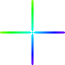

<p align="center">
    
</p>

# scolorpicker
scolorpicker (`smooll's Color Picker`) is a color picker application available on Linux for both X11 and Wayland!

## Table of Contents
* [Features](#features)
    * [Completed](#completed)
    * [Planned](#planned)
* [Installation](#installation)
    * [Dependencies](#dependencies)
        * [X11](#x11)
        * [Wayland](#wayland)
    * [AUR](#aur)
        * [yay](#yay)
        * [paru](#paru)
    * [Manual (Building from Source)](#manual-building-from-source)
        * [Cloning](#cloning)
        * [Legacy Version](#legacy-version)
        * [Configuration](#configuration)
        * [Building](#building)
* [Usage](#usage)
* [Contributing](#contributing)
    * [Donation](#donation)
    * [Reporting an Issue](#reporting-an-issue)

## Features
Here's a list of features both completed and planned marked by versions which they came in.

### Completed
* color preview of the current hovered over pixel (v1.0.0)
* color formats:
    * hex (v1.0.0)
    * lhex (v2.0.0)
    * rgb (v1.1.0)
    * hsl (v2.0.0)
    * hsv (v2.0.0)
    * all (v2.0.0)
* color outputs:
    * terminal (v1.1.0)
    * clipboard (v1.0.0)

### Planned
* rounded color preview borders
* saving to clipboard manually instead of using external programs

## Installation
scolorpicker has a couple installation methods with more (like a flatpak package) planned.

### Dependencies
* SDL3 (*)
* SDL3_image (*)

#### X11
* Xlib or xcb (for screenshots)
* xcb-image (only if using xcb)

#### Wayland
* sdbus-c++ (for screenshots) (*)
* [desktop portal](https://wiki.archlinux.org/title/XDG_Desktop_Portal) which supplies [Screenshot](https://flatpak.github.io/xdg-desktop-portal/docs/doc-org.freedesktop.portal.Screenshot.html) + its dependencies (e.g. `xdg-desktop-portal-wlr` + grim)

(*) - if installing through the AUR or building manually, these are optional.

### AUR
If using Arch Linux, you can very simply install scolorpicker from the AUR (Arch User Repository) using an AUR helper (e.g. [yay](https://github.com/Jguer/yay) or [paru](https://github.com/Morganamilo/paru/)).

#### yay
```bash
$ yay -S scolorpicker
```

#### paru
```bash
$ paru -S scolorpicker
```

### Manual (Building from Source)
If you cannot use any of the above options for installation, you can always build manually, and thanks to the way scolorpicker is set up, you need only three commands to clone, build and install your very own version!

#### Cloning
When cloning the repo, be sure to clone a specific tag and not the master branch. This will ensure that your build is stable.

```bash
git clone --depth=1 --branch=v2.0.0 https://github.com/smooll-d/scolorpicker.git
```

##### Legacy Version
`v2.0.0` marks the complete, from the ground up rewrite of scolorpicker in C++ instead of C and SDL3 to handle everything other than screenshots.

For those that use X11 only and don't want to install so many dependencies, there is a "backup" of the first version on the `legacy` branch which can be cloned like this:

```bash
git clone --depth=1 --branch=legacy https://github.com/smooll-d/scolorpicker.git
```

#### Configuration
scolorpicker comes with some options you can enable to configure the platform for which you're building:

| Option                  | Description                                                   |
|------------------------ | --------------------------------------------------------------|
| SCP_ENABLE_X11          | Build using X11 backend                                       |
| SCP_ENABLE_XLIB         | Use Xlib when building for X11                                |
| SCP_ENABLE_XCB          | Use XCB when building for X11                                 |
| SCP_ENABLE_WAYLAND      | Build using Wayland backend                                   |
| SCP_ENABLE_LINUX        | Build for both X11 and Wayland                                |
| SCP_ENABLE_AUTO         | Detect backend automatically **[This is the default]**        |
| SCP_FORCE_XLIB          | Force Xlib when building for X11 (used with SCP_ENABLE_LINUX) |
| SCP_FORCE_XCB           | Force XCB when building for X11 (used with SCP_ENABLE_LINUX)  |
| SCP_BUILD_DEPENDENCIES  | Download and build dependencies instead of using system ones  |
| SCP_BUILD_DOCUMENTATION | Compress man pages and install if necessary                   |

If you don't know what to do, use this:
```bash
cmake -S . -B build -DCMAKE_PREFIX_INSTALL=/usr
```

It will detect what your system is automatically.

Remove `-DCMAKE_PREFIX_INSTALL=/usr` if you do not wish to install scolorpicker system-wide.

#### Building
```bash
cmake --build build -j$(nproc)
```

This will build the project using as many jobs as there are cores on your processor. It'll take much less time to build.

> [!TIP]
> If you used `SCP_BUILD_DOCUMENTATION`, you can generate ready-to-install man pages after building for the first time:
> ```bash
> cmake --build build --target dist
> ```

If you used `-DCMAKE_PREFIX_INSTALL=/usr`, you can install scolorpicker system-wide:
```bash
sudo cmake --install build
```

## Usage
The most basic usage of scolorpicker is:

```bash
scolorpicker
```

By default, it'll print the color in uppercase hex to the terminal.

If you'd like to read up about what more's there to do, you can either:
```bash
scolorpicker --help
```

or:
```bash
man scolorpicker
```

Have fun!

## Contributing
If you like scolorpicker and would like to contribute in some way, you can do it in two ways.

### Donation
The best way to donate is to my [PayPal](https://paypal.me/smoolld), but you can also donate to my [Ko-fi](https://ko-fi.com/smooll). Don't worry, there are no memberships.

### Reporting an Issue
If you've found a bug or would like to submit a feature request for a new output method or format, you can do it in the [Issues](https://github.com/smooll-d/scolorpicker/issues) tab.
