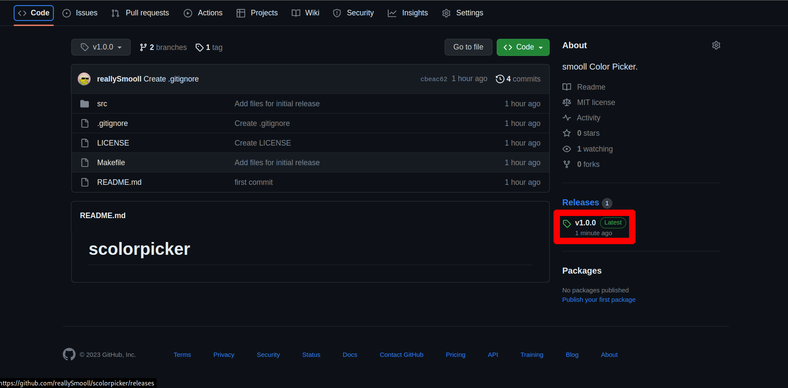
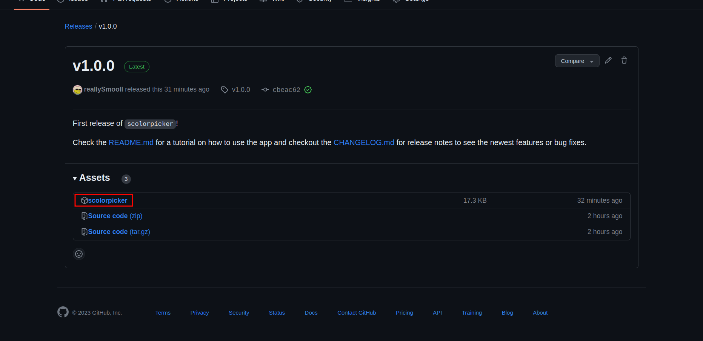

# scolorpicker
scolorpicker is a color picker application written in C using nothing but Xlib.

This is why scolorpicker can be installed anywhere an X.Org server is installed, is very lightweight with the executable clocking in at just 27k and has very little
dependencies.

## Installation

### Dependencies
If you want to manually build scolorpicker or download it from [Releases](https://www.github.com/reallySmooll/scolorpicker/releases), you need to install some dependencies:

**NOTE: These package names are for Arch Linux. You will need to get the names of these packages for other distros yourself.**

- glibc (C standard library, you almost certainly don't need to install it if you've installed development packages for your distro, e.g. base-devel for Arch Linux)
- libx11 (scolorpicker needs this library to work)
- xsel (scolorpicker needs this to make clipboard saving, there are plans to remove this dependency and save to clipboard without any external libraries)
- libxext (scolorpicker needs this library to make the window corners round, if scolorpicker for some reason cannot enable the Shapes extension, the window will default to straight corners)

---

There are three ways of installing scolorpicker:

- Using an AUR wrapper (e.g. `yay` or `paru`) **RECOMMENDED**

    Using `yay`:
    ```bash
    $ yay -S scolorpicker
    ```

    Using `paru`:
    ```bash
    $ paru -S scolorpicker
    ```

- Using the executable from [Releases](https://www.github.com/reallySmooll/scolorpicker/releases)

    First, go to the latest release of scolorpicker (in this case it's `v1.0.0`):

    

    Next, go download the `scolorpicker` executable:

    

    After you download it, you can use it by executing it in the command line:
    ```bash
    $ directory/to/where/you/downloaded/scolorpicker
    ```

    If you'd like to have it in you `PATH` and use it without moving into the directory where you have the executable you can move (or copy) it to `/usr/bin` for example:
    ```bash
    $ sudo mv directory/to/where/you/downloaded/scolorpicker /usr/bin
    # or copy it
    $ sudo cp directory/to/where/you/downloaded/scolorpicker /usr/bin
    ```

    And then wherever you are, you can do:
    ```bash
    $ scolorpicker
    ```

- Building if from source

    First, clone the repository and cd into the directory:
    ```bash
    $ git clone https://github.com/reallySmooll/scolorpicker.git
    $ cd scolorpicker/
    ```

    Next, build and install scolorpicker:
    ```bash
    $ cmake -DINSTALL_SYSTEM_WIDE=YES -S . -B build
    $ cd build/
    $ cmake --build .
    $ sudo cmake --install .
    ```

    And that's it! `cmake` will build the application automatically and copy the executable into the `/usr/bin/` directory so you can use it like any other command without having to cd into the directory and running it from there!

## Usage
Usage is pretty straight-forward, you start the application and click on the pixel you want to get the color of and it will be copied to your clipboard.

Which means that if everything works out, scolorpicker should output nothing to the terminal.

But if you'd like more from the program, in the terminal type:
```bash
$ scolorpicker --help # or -h
```

A help menu will pop up with all options explained.

## Features
Here's a list of features already implemented and ones I would like to implement in the (near?) future:

- [X] Small window displaying the color of the current pixel (v1.0.0)
- [X] Color code in hexadecimal (v1.0.0)
- [X] Color output to clipboard using `xclip` (v1.0.0) **NOTE: As of v1.2.0 `xclip` is no longer used in favor of `xsel` to fix a bug**
- [X] Color code output in different modes (RGB, HSV, HSL, etc.) (v1.1.0)

    Available modes:
    - `hex` - Hexadecimal
    - `rgb` - Red, Green, Blue

- [X] Ability to choose to output the color code to the terminal instead of the clipboard (v1.1.0)
- [X] Rounded window corners (v1.2.0)
- [ ] Saving to clipboard without the use of ~~`xclip`~~ `xsel`
- [ ] System tray so you don't have to enter a command in the terminal to get the color of a pixel (which, I'll admit is pretty dumb)
